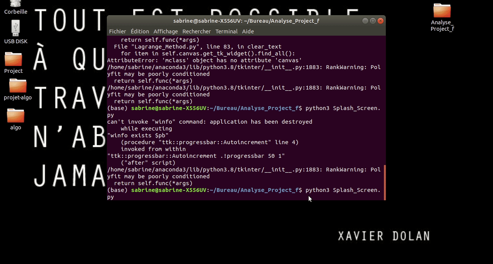
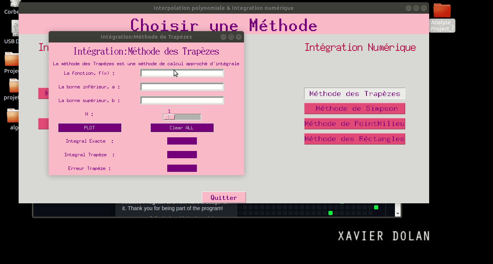
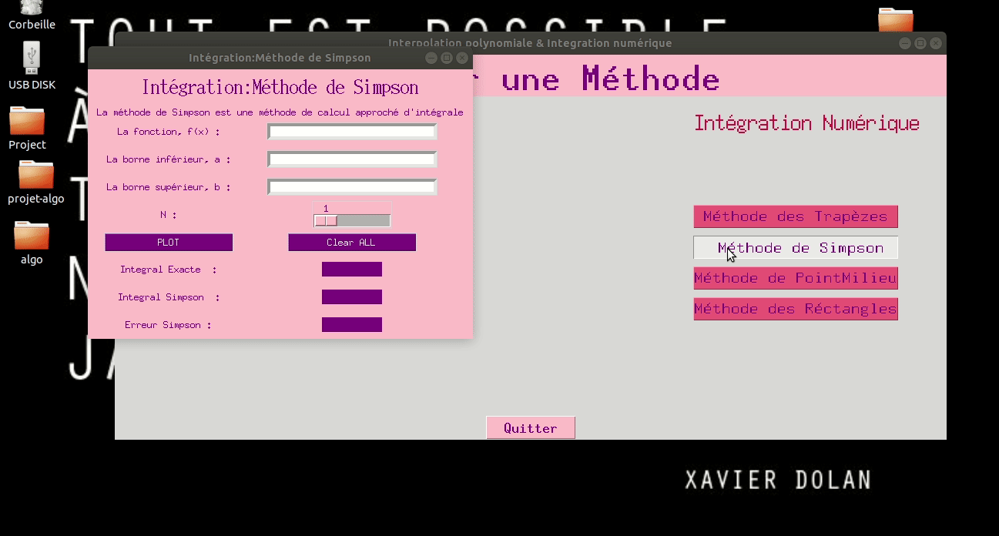
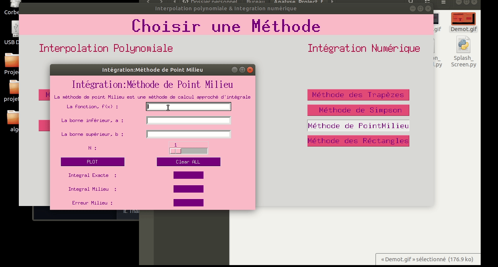
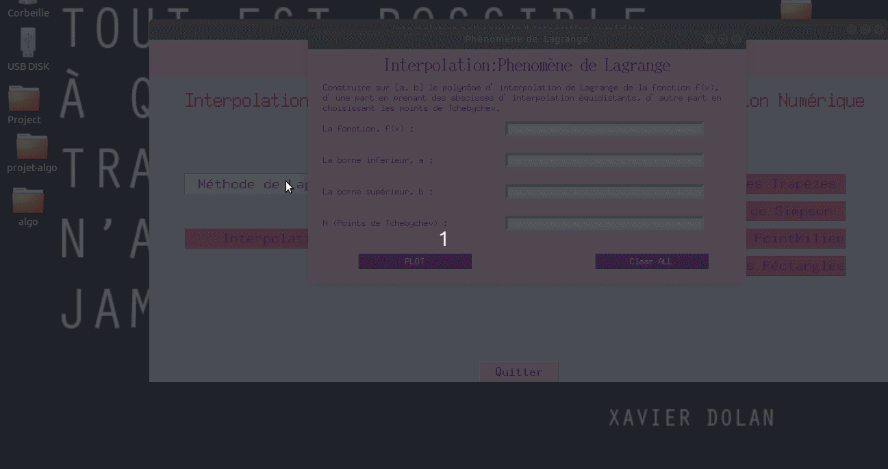

# Analyse_Project
ce Projet contient un Menu qui permet à l'utilisateur de chosir soit d'appliquer les Méthodes d'Intégration Numérique ou bien Les Méthodes d'intérpolation Polynomiale.

Il s'agit de plusieurs interfaces Tkinter(Bibliothèque GUI en Python) qui permettent:
  * Caculer et représenter  l'intégrale d'une Fonction f(x) en utilisant les méthodes suivants

	#### 1. Méthode des trapèzes
	
	
	#### 2.Méthode de Simpson.
	
	#### 3.Méthode des Réctangles.
	
	#### 4.Méthode de Point Milieu.
	
* représentation du phènomene de Lagrange en Variant N .

* Calculer et représenter l'interpolation Polynomiale.

